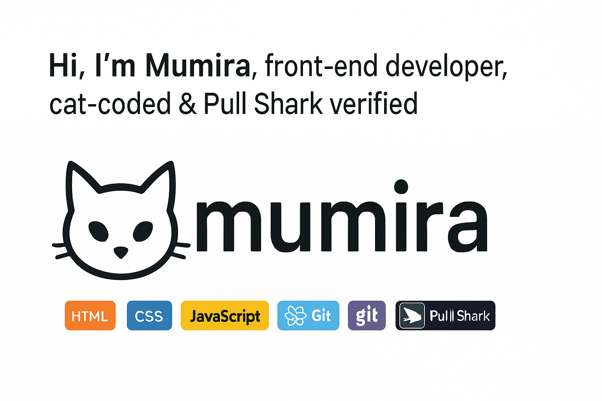

# 👋 Hey there, I'm Mumira 🐾

Welcome to my cozy corner of the web. I'm a **web developer** with a love for clean code, sleek designs, and a sprinkle of ✨ cat energy ✨ in everything I build.

---

## 💻 What I Do
- 🔧 Frontend Development (React, JavaScript, HTML, CSS)
- 🧪 Experimenting with new tech
- 🐱 Building fun, themed UIs

---

## 🌱 Currently Learning
- React and UI functionality
- Advanced CSS for slick, minimal UI
- REST APIs & Full-stack workflows

---

## 📁 Featured Projects
| Project | Tech | Description |
|--------|------|-------------|
| [Catgram](#) | React, CSS | A cat-themed photo-sharing app |
| [Smart Goal Tracker](#) | JavaScript, HTML, CSS | Set & track goals with a clean UI |
| [Recipe Finder](#) | React, API | Find meals fast from TheMealDB |

---

## 🏆 GitHub Achievements  
- ✅ [First Pull Request](https://github.com/sharonn101/phase-2-project/pull/7) — *"One small step for code, one giant leap for Mumira!"*

---

### 🧠 Languages & Tools  

  
  
  
  
  
  
  

## 🐾 Fun Facts
- My cat **Shosh** is my coding buddy.
- I add features to my projects as I learn — it's a living portfolio.
- Cat-coded? Always. Minimalist? Absolutely. Black theme? Non-negotiable.

---

## 📫 Let's Connect
- Portfolio: [coming soon]
- GitHub: [github.com/mumira-bit](https://github.com/mumira-bit)

---

> _“Code with claws. Deploy with paws.”_

